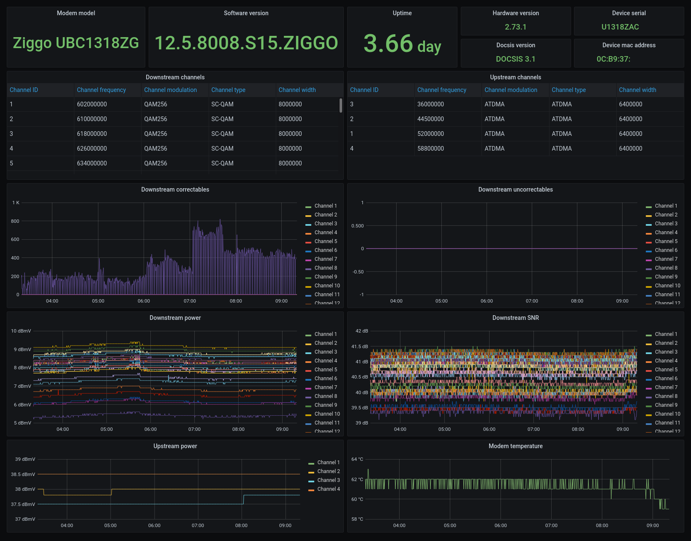

# Prometheus Ubee Exporter

Exporter for
the [Ubee UBC1318](https://www.ubeeinteractive.com/?product=ubc1318-docsis-3-1-small-medium-enterprise-gateway) cable
modem. Commonly used by Ziggo, a Dutch ISP.

## Usage
```
usage: prometheus-ubee-exporter [-h] [--modem-host MODEM_HOST] [--modem-tls] [--metrics-port METRICS_PORT] [--metrics-listen METRICS_LISTEN] [--wait-for-initial-data]

An exporter for the Ubee UBC1318 cable modem (commonly used by Ziggo, a Dutch ISP).

options:
  -h, --help            show this help message and exit
  --modem-host MODEM_HOST
                        Host to connect to the modem. (default: 192.168.178.1)
  --modem-tls           Use a TLS connection to the modem (for example when modem is behind a reverse proxy). (default: False)
  --metrics-port METRICS_PORT
                        Port to listen on. (default: 9908)
  --metrics-listen METRICS_LISTEN
                        IP to listen on. (default: )
  --wait-for-initial-data
                        Only start listening for metric requests once initial data has been loaded from the modem. (default: False)
```

## Dashboard
You can import the `dashboard.json` into grafana for a nice visual representation of your modem

